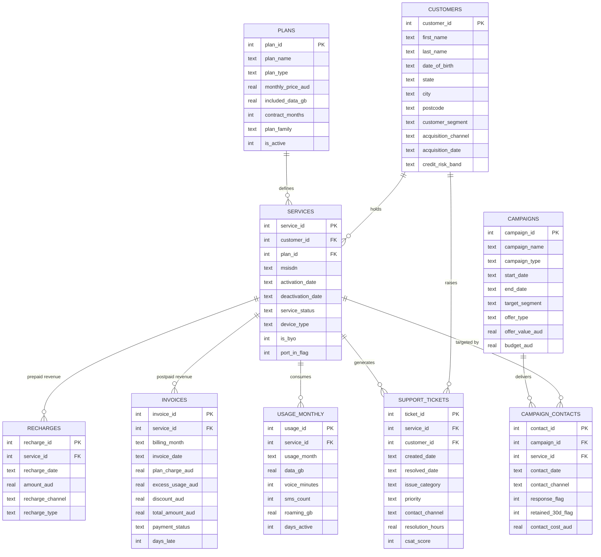
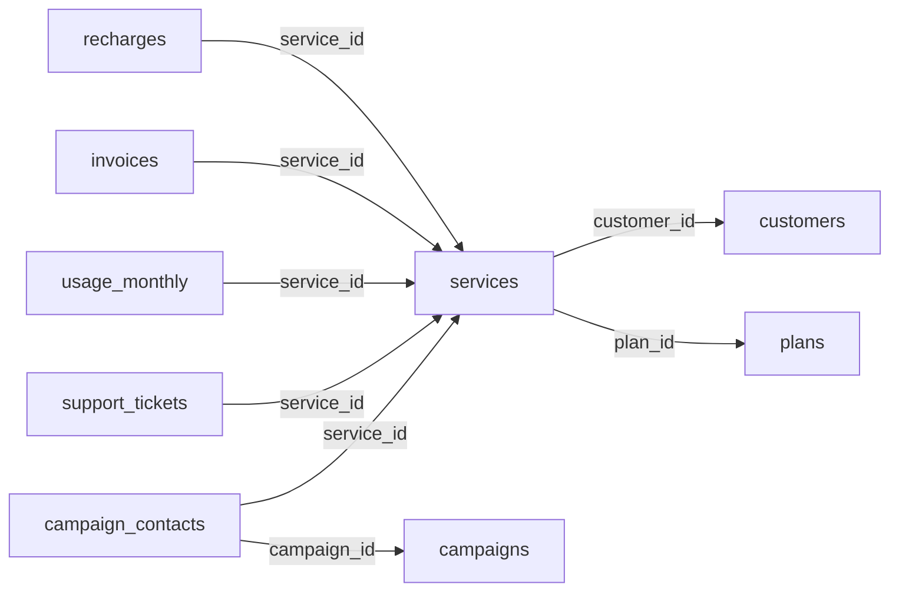

# Entity Relationship Diagram

GitHub renders Mermaid natively, so this diagram displays directly in the repository with no image file to keep in sync.

---

## Full model

---

## How to read this model

**`SERVICES` is the hub.** Six of the nine tables join to it. Any question about churn, revenue or behaviour resolves to a service, and almost every query in this project starts or passes through this table.

**Revenue is deliberately split.** `RECHARGES` holds prepaid revenue as irregular events; `INVOICES` holds postpaid revenue as regular monthly bills. There is no single revenue table, because in reality there is no single billing system. Any blended revenue or ARPU figure requires a `UNION ALL` of the two.

**Churn is asymmetric.** Postpaid churn is a stored fact — `SERVICES.deactivation_date`. Prepaid churn is not stored anywhere; it must be derived from gaps in `RECHARGES.recharge_date` under Decision D1. This asymmetry drives most of the SQL difficulty in Phase 4, and it is intentional.

---

## The join paths you will use most

| Question | Path |
|---|---|
| Prepaid revenue by state | recharges → services → customers |
| Postpaid revenue by plan family | invoices → services → plans |
| Blended ARPU | (recharges ∪ invoices) → services |
| Churn by segment | services → customers (+ derived churn from recharges) |
| Usage decay before churn | usage_monthly → services |
| Campaign ROI | campaign_contacts → campaigns, and → services for revenue |

Note that a question phrased in **business** terms ("revenue by state") maps to a **three-table** join, because revenue and geography sit at opposite ends of the model. Recognising that translation quickly is most of what SQL fluency actually is.
