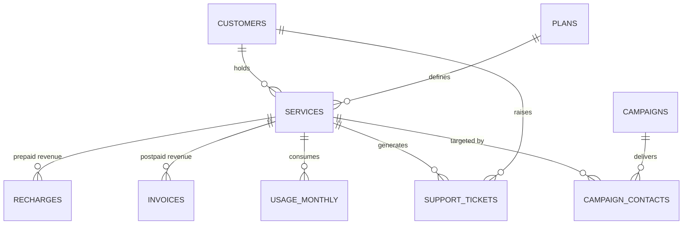

# Subscriber Churn & ARPU Recovery Analysis — Waratah Telecom

An end-to-end Data Analyst / Business Analyst portfolio project: from business context and requirements gathering, through SQL and Python analysis, to dashboards, predictive modelling and an executive recommendation.

**Business context:** Australian retail mobile market · **Analyst:** Kurt · **Status:** In progress

> Waratah Telecom is a fictional company. The dataset is synthetic and generated by committed code. The business problem, methodology and analytical decisions are modelled on how this work is actually done in an Australian telco.

---

## The problem

Waratah Telecom is a challenger mobile operator headquartered in Sydney, running ~1.4 million services across NSW, VIC and QLD on a wholesale network. Across FY25, four metrics moved against it at once:

| Metric | Start FY25 | End FY25 | Movement |
|---|---|---|---|
| Blended monthly churn | 1.6% | 2.6% | ▲ 1.0 pp |
| Prepaid monthly churn | — | 3.1% | Worst segment |
| Blended ARPU | AUD 44.20 | AUD 40.10 | ▼ AUD 4.10 |
| Net adds | Positive | Negative | Base shrinking |
| Cost per acquisition | Baseline | +18% | Acquisition costlier |

**Approximately AUD 65M in annualised revenue at risk.** Leadership can see the trend but cannot answer who is leaving, why, or which retention levers repay their cost.

## Objectives

| # | Objective | Target |
|---|---|---|
| SO1 | Reduce blended monthly churn | ≤ 2.0% |
| SO2 | Recover blended ARPU | ≥ AUD 43.00 |
| SO3 | Retain top-value customers | ≥ 95% in top decile |
| SO4 | Target retention spend | ≥ 60% of spend targeted |

---

## Three decisions that shape everything downstream

Analysis is a series of judgement calls. These three were made before any query was written, and each is documented with its rationale, its trade-off and the alternatives rejected.

### D1 — How churn is defined

**Prepaid:** 60 consecutive days with no recharge **and** no billable usage.
**Postpaid:** cancellation / port-out on the deactivation date.

Prepaid customers never announce their departure — there is no contract to cancel, so churn must be inferred from silence. Recharge cycles run 28–35 days, so 60 days is **two missed cycles**: long enough to exclude temporary sleepers, short enough to preserve a win-back window. Postpaid needs no inference because cancellation is a contractual event.

*Trade-off accepted:* churn is only confirmable 60 days in arrears, so the two most recent months of any prepaid churn series are provisional and labelled as such.

### D2 — What is in scope

Both prepaid and postpaid, analysed at **equal weight**, reported side-by-side and segmented in every analysis.

Postpaid is the revenue engine; prepaid is where the churn spike lives. Analysing postpaid alone misses the volume risk; prepaid alone misses the revenue risk. The two also have structurally different churn mechanics and separate revenue tables, so a blended-only view would average away the exact signal the project exists to find.

*Cost accepted:* roughly double the analytical work, and every metric needs an explicit blending rule.

### D3 — What we optimise for

**Churn reduction is the north star. ARPU is a guardrail:** no retention initiative may push blended ARPU below **AUD 39.00**.

With net adds negative and CAC up 18%, base erosion compounds — retention is the cheaper lever. ARPU recovery then follows from targeted upsell into a stabilised base rather than defending price on a shrinking one. The guardrail exists because two north-stars is no north-star; when churn and ARPU conflict, this resolves it in advance and prevents the classic retention death spiral where churn is "fixed" by discounting everyone and revenue falls faster than churn.

---

## Repository structure

| Folder | Contents | Status |
|---|---|---|
| [`01_business_context`](./01_business_context) | Company profile, problem statement, stakeholder map, objectives, decisions D1–D3 | ✅ Complete |
| [`02_business_analysis`](./02_business_analysis) | BRD, FRD, KPI definitions with traceability | ✅ Complete |
| [`03_data_model`](./03_data_model) | Data dictionary, ER diagram, schema, seed data, generator | ✅ Complete |
| [`04_sql_analysis`](./04_sql_analysis) | Joins, CTEs, window functions; cohort, funnel, retention, revenue | 🔜 Next |
| [`05_data_cleaning`](./05_data_cleaning) | Python cleaning, validation, quality profiling | ⬜ Planned |
| [`06_eda`](./06_eda) | Exploratory analysis and churn driver investigation | ⬜ Planned |
| [`07_dashboards`](./07_dashboards) | Executive, operational and customer dashboards (Power BI + DAX) | ⬜ Planned |
| [`08_advanced_analytics`](./08_advanced_analytics) | Churn prediction and behavioural segmentation | ⬜ Planned |
| [`09_recommendations`](./09_recommendations) | Prioritised recommendations with quantified impact | ⬜ Planned |
| [`10_executive_presentation`](./10_executive_presentation) | Executive deck and one-page summary | ⬜ Planned |
| [`11_portfolio_packaging`](./11_portfolio_packaging) | Portfolio write-up, LinkedIn and résumé assets | ⬜ Planned |
| [`12_interview_prep`](./12_interview_prep) | DA and BA interview Q&A on this project | ⬜ Planned |

---

## The data model

Nine tables at **service grain** (a customer may hold several SIMs, and can churn one while keeping others).



Full detail: [ER diagram](./03_data_model/er_diagram.md) · [Data dictionary](./03_data_model/data_dictionary.md)

### Two design choices that make this project non-trivial

**1. There is no prepaid churn flag.** A churned prepaid service still reads `service_status = 'Active'` with a NULL deactivation date, exactly as it would in a real billing system. Churn has to be derived from gaps between recharge dates using window functions. A naive `COUNT(*) WHERE status = 'Active'` overstates the live base.

**2. Revenue lives in two tables.** Prepaid revenue sits in `recharges` as irregular events; postpaid revenue sits in `invoices` as monthly bills. Blended ARPU therefore needs a `UNION ALL`, mirroring the real problem of reconciling two billing stacks.

---

## Dataset

Synthetic, generated by [`generate_data.py`](./03_data_model/generate_data.py), covering **Jan 2024 – Jun 2025** (FY25 plus six months of lead-in, because the 60-day churn rule and cohort curves need prior history).

| Table | Seed rows |
|---|---|
| customers | 40 |
| plans | 10 |
| services | 51 |
| recharges | 250 |
| invoices | 472 |
| usage_monthly | 735 |
| support_tickets | 40 |
| campaigns | 6 |
| campaign_contacts | 71 |

The generator is calibrated so the synthetic data reproduces the business case rather than contradicting it. Verified at 5,000-customer scale:

| Measure | Business case | Generated |
|---|---|---|
| Postpaid / prepaid service mix | 62% / 38% | 61.7% / 38.3% |
| Blended ARPU, start of window | AUD 44.20 | AUD 44.51 |
| Blended ARPU, end of window | AUD 40.10 | AUD 40.15 |
| Prepaid cumulative churn (18 mo) | ~43% | 41.9% |
| Postpaid cumulative churn (18 mo) | ~33% | 29.7% |

### The dataset contains sleepers, deliberately

About 11% of prepaid services take a single long recharge break — 60 to 88 days — and then come back, while continuing to use data throughout. They are **not** churned.

This is the reason Decision D1 reads "no recharge **AND** no billable usage". A rule written on recharge gaps alone marks every one of these customers as churned and over-states prepaid churn by roughly a sixth. The data contains both sleepers and genuine leavers so the distinction has to be handled rather than assumed away.

Scale it up for later phases:

```bash
python 03_data_model/generate_data.py --customers 5000
```

---

## Getting started

**Option A — browser, no install (fastest):**

1. Open [sqliteonline.com](https://sqliteonline.com)
2. Paste and run [`03_data_model/schema.sql`](./03_data_model/schema.sql)
3. Paste and run [`03_data_model/seed_data.sql`](./03_data_model/seed_data.sql)
4. Verify: `SELECT COUNT(*) FROM services;` should return **51**

**Option B — local Python:**

```bash
cd 03_data_model
python - <<'EOF'
import sqlite3
con = sqlite3.connect("waratah.db")
con.executescript(open("schema.sql").read())
con.executescript(open("seed_data.sql").read())
print(con.execute("SELECT COUNT(*) FROM services").fetchone())
EOF
```

CSV extracts for pandas live in [`03_data_model/data/`](./03_data_model/data).

---

## Skills demonstrated

**Business analysis** — stakeholder mapping, requirements elicitation, BRD/FRD authoring, MoSCoW prioritisation, requirements traceability, KPI governance, risk and assumption management.

**Data & SQL** — dimensional modelling at a chosen grain, schema design with constraints, joins, CTEs, window functions, cohort and retention analysis, revenue reconciliation across sources.

**Python** — synthetic data generation, cleaning and validation, exploratory analysis, predictive modelling, segmentation.

**BI & communication** — dashboard design for distinct audiences, DAX, executive storytelling, translating analysis into costed recommendations with named owners.

**Judgement** — the part that matters most: defining churn defensibly, choosing a north-star and a guardrail, separating correlation from causation, and stating limitations before someone else finds them.

---

## Licence

MIT — see [LICENSE](./LICENSE). Educational portfolio project; Waratah Telecom is fictional and the data is synthetic.
